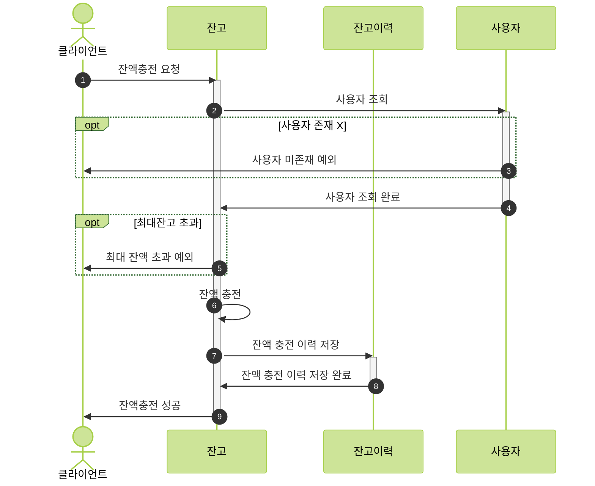
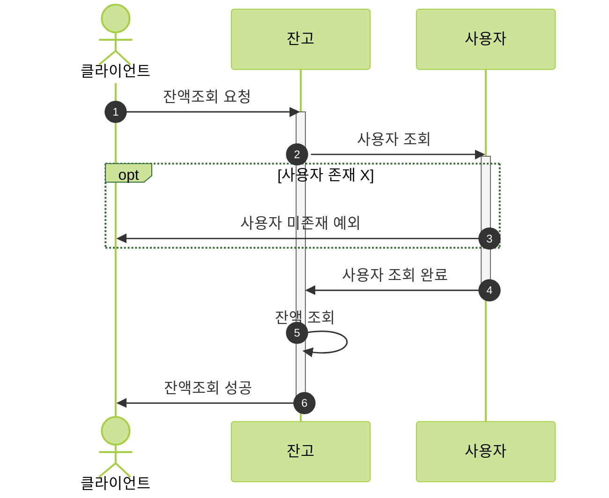
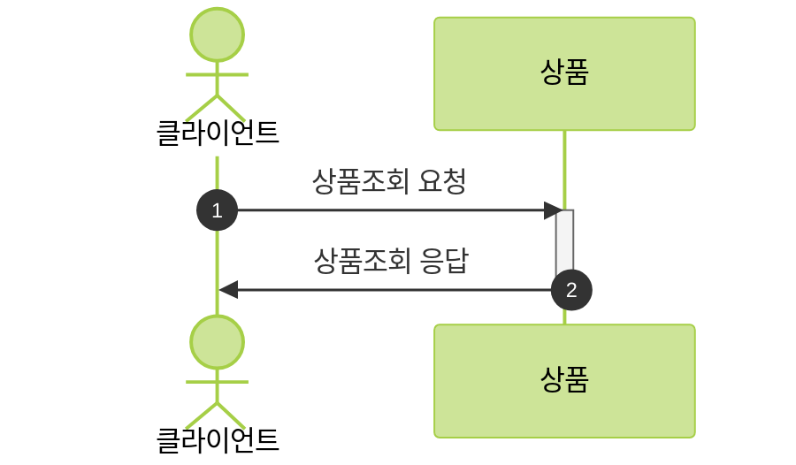
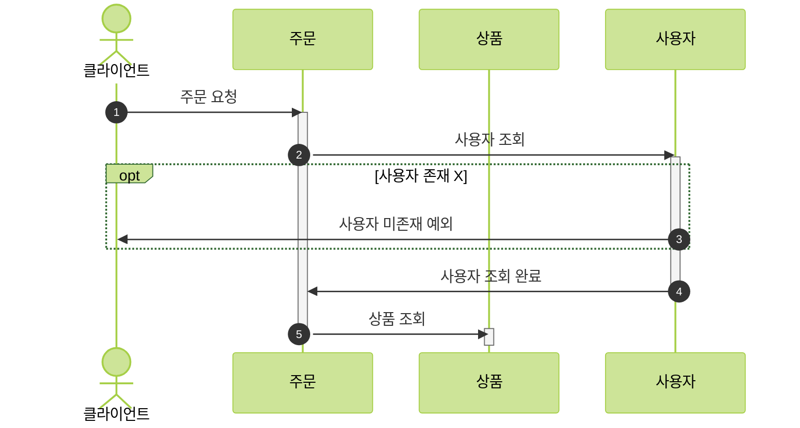
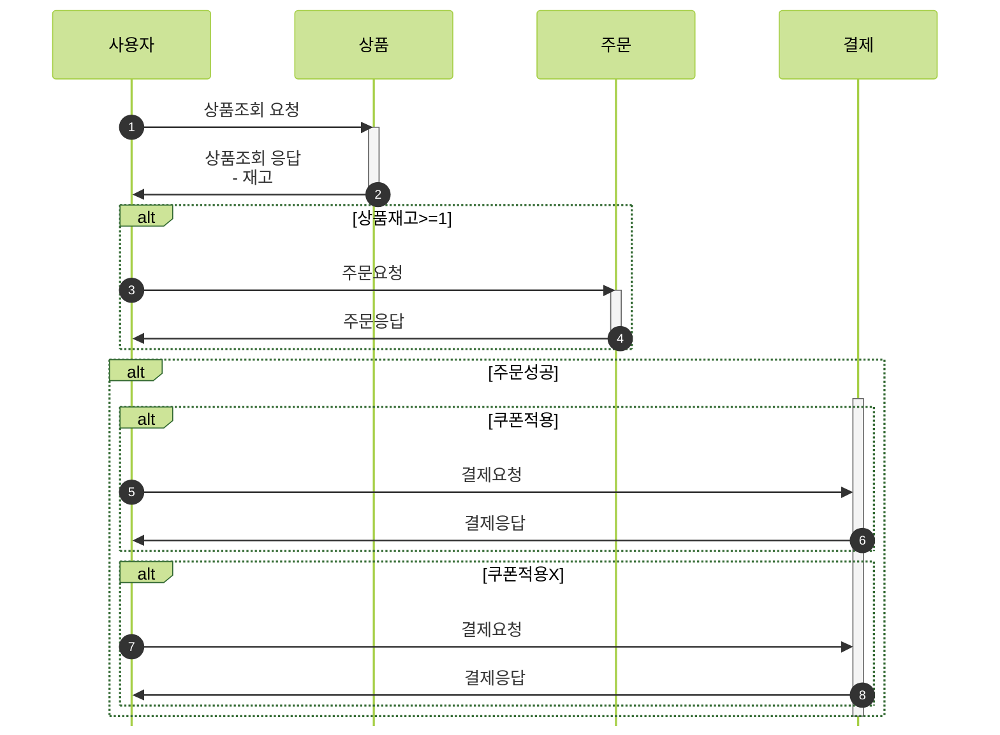
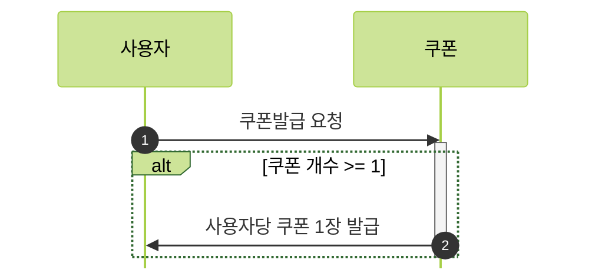
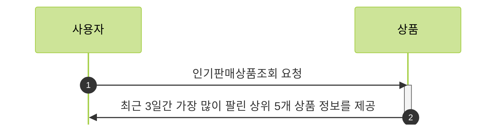

    ## e-커머스 서비스 시퀀스 다이어그램

## 목차

1. [잔액충전](#1-잔액충전)
2. [잔액조회](#2-잔액조회)
3. [상품조회](#3-상품조회)
4. [주문](#4-주문)
5. [결제](#5-결제)
6. [선착순쿠폰](#6-선착순쿠폰)
7. [인기판매상품조회](#7-인기판매상품조회)

---

## 1. 잔액충전

---

## 2. 잔액조회

---

## 3. 상품조회

---

## 4. 주문

---

## 5. 결제

---

## 6. 선착순쿠폰

---

## 7. 인기판매상품조회

---